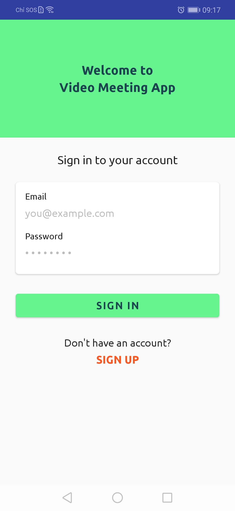
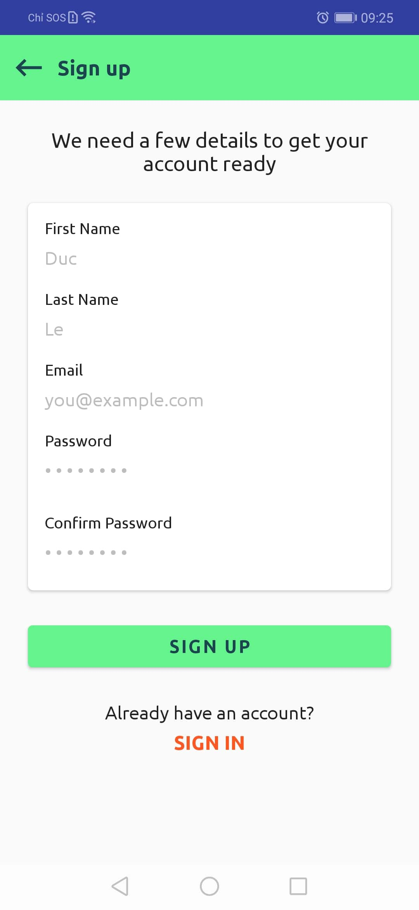
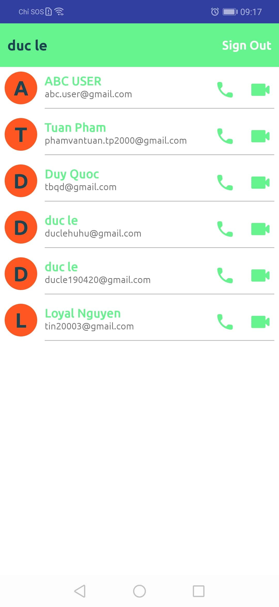
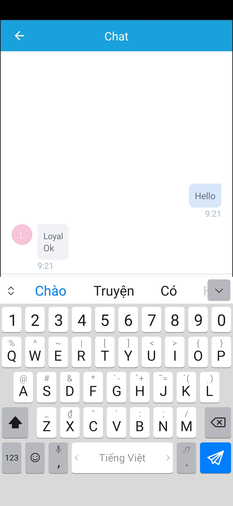
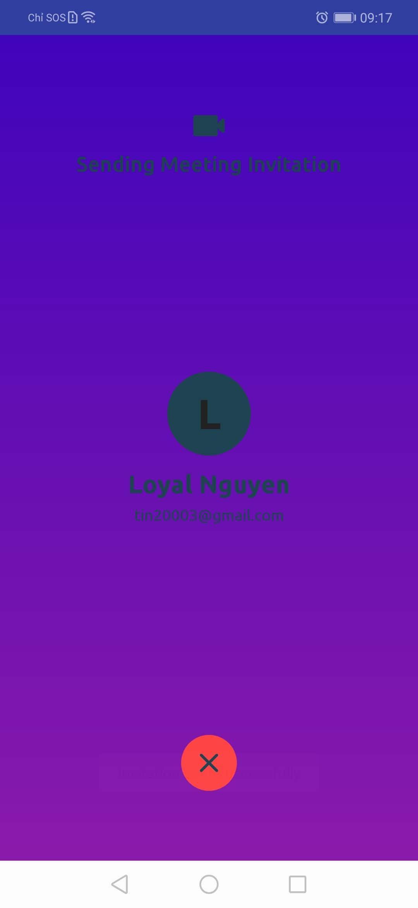
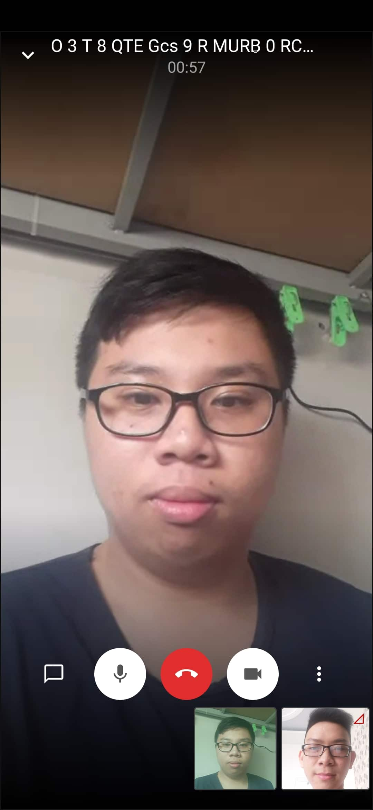
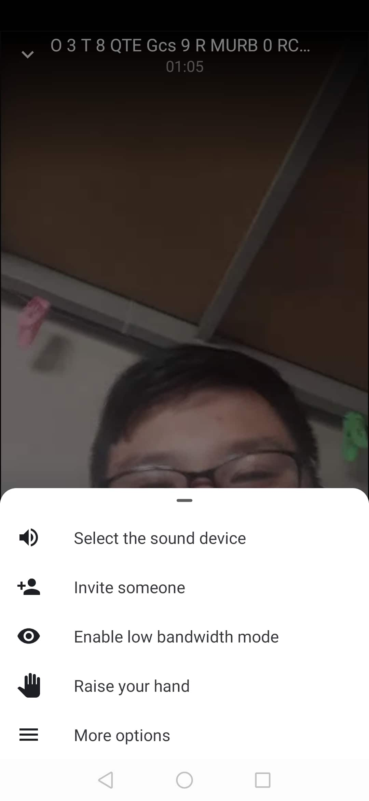

<!-- TABLE OF CONTENTS -->
<details open="open">
  <summary>Table of Contents</summary>
  <ol>
    <li>
      <a href="#about-the-project">About The Project</a>
    </li>
    <li>
      <a href="#getting-started">Getting Started</a>
      <ul>
        <li><a href="#main-functionalities">Main Functionalities</a></li>
        <li><a href="#installation">Installation</a></li>
        <li><a href="#attributes">Attributes</a></li>
      </ul>
    </li>
    <li><a href="#usage">Usage</a></li>
    <li><a href="#contributing">Contributing</a></li>
    <li><a href="#license">License</a></li>
    <li><a href="#contact">Contact</a></li>
    <li><a href="#acknowledgements">Acknowledgements</a></li>
  </ol>
</details>


<!-- ABOUT THE PROJECT -->
## About The Project

<!-- [![Product Name Screen Shot][product-screenshot]](https://example.com) -->

Apply Agile process to build a mobile app streamming by Android. Use the WebRTC Jitsi server.
In this project we will build a video meeting or conference application
First of all, let's understand the idea of this application. To implement real-time activity like video meetings we must have some identity or destination link to the receiver. 

---

For that, Users will sign up for their account using some basic details like the first name, last name, email, and password. To store all of the user data we will be using the cloud fire store database, which is a flexible and scalable database for mobile, web, and server development from Firebase and Google Cloud Platform.


---
After sign up, the user will sign in to their account using email and password. We will store logged user information into shared preferences to handle auto-sign in so users don't need to enter email and password every time.


---
After sign in, we will display a list of other users that are signed up in our application except for the currently logged user because nobody is going to start a video meeting with himself.

---

In a video meeting, the user will initiate the video meeting by sending a meeting invitation to another user. To send a meeting invitation we will use firebase cloud messaging which is a cross-platform messaging solution that lets you reliably send messages at no cost. Using FCM, you can notify a client app that a new email or other data is available to sync.

---

Once the meeting invitation sent, the receiver has two options, accept or reject the invitation. On acceptance or rejection, the related response message will be sent to the meeting initiator or sender. If the user wants to cancel the meeting invitation then it can be done by the hang-up process, in which another remote message will be sent to the receiver to cancel the current meeting invitation. This is the complete meeting invitation process.

---

On acceptance of the meeting invitation, the video meeting will start using the Jitsi Meet. To implement video meetings or conferences lots of groundwork is needed, to simplify this process we will use a pre-built Jitsi Meet client which is a free, open-source project that provides web browsers and mobile applications with real-time communication (RTC) via simple application programming interfaces (APIs). It allows audio and video communication to work inside applications and web pages by allowing direct peer-to-peer communication, eliminating the need to install plugins or download native apps. This Jitsi Meet client provides the facilities like, switch sound devices, invite more people to the meeting, audio-only mode, toggle camera, tile view in case of more people. The best part is you can also start chat conversion during video meetings.

---


A list of commonly used resources that I find helpful are listed in the acknowledgements.


<!-- GETTING STARTED -->
## Getting Started

This is an example of how you may give instructions on setting up your project locally.
To get a local copy up and running follow these simple example steps.

### Main Functionalities

Final project of Software Engineer on TDTU. <br/>
Follow team by Trello: https://trello.com/b/P5FLtkjl/video-meeting

### Installation

1. Clone the repo
   ```sh
   git clone https://github.com/Software-Engineering-G7-P8/jitsi-android.git
   ```
2. Install Android Studio
   ```sh
   https://developer.android.com/studio/install
   ```
3. Run the project
   ```sh
   https://developer.android.com/training/basics/firstapp/running-app
   ```
### Attributes
+ Sign In Screen.<br />
{:height="400px" width="200px"}
+ Sign Up Screen.<br />
{:height="400px" width="200px"}
+ List User Screen.<br />
{:height="400px" width="200px"}
+ Chat Screen.<br />
{:height="400px" width="200px"}
+ Sending Call Invitation.<br />
.jpg){:height="400px" width="200px"}
+ Sending Video Invitation.<br />
{:height="400px" width="200px"}
+ Video Meeting Screen.<br />
{:height="400px" width="200px"}
+ Option Video Meet.<br />
{:height="400px" width="200px"}

<!-- USAGE EXAMPLES -->
## Usage

Use this space to show useful examples of how a project can be used. Additional screenshots, code examples and demos work well in this space. You may also link to more resources.

_For more examples, please refer to the [Documentation]


<!-- ROADMAP -->
## Roadmap

See the [open issues](https://github.com/othneildrew/Best-README-Template/issues) for a list of proposed features (and known issues).


<!-- CONTRIBUTING -->
## Contributing

Contributions are what make the open source community such an amazing place to be learn, inspire, and create. Any contributions you make are **greatly appreciated**.

1. Fork the Project
2. Create your Feature Branch (`git checkout -b demo/jitsi-android`)
3. Commit your Changes (`git commit -m 'Add some AmazingFeature'`)
4. Push to the Branch (`git push origin demo/jitsi-android`)
5. Open a Pull Request


<!-- LICENSE -->
## License

Distributed under the MIT License. See `LICENSE` for more information.


<!-- CONTACT -->
## Contact

Project Link: [https://github.com/Software-Engineering-G7-P8/jitsi-android](https://github.com/Software-Engineering-G7-P8/jitsi-android)


<!-- ACKNOWLEDGEMENTS -->
## Acknowledgements
* [GitHub Emoji Cheat Sheet](https://www.webpagefx.com/tools/emoji-cheat-sheet)
* [Img Shields](https://shields.io)
* [Choose an Open Source License](https://choosealicense.com)
* [GitHub Pages](https://pages.github.com)
* [Animate.css](https://daneden.github.io/animate.css)
* [Loaders.css](https://connoratherton.com/loaders)
* [Slick Carousel](https://kenwheeler.github.io/slick)
* [Smooth Scroll](https://github.com/cferdinandi/smooth-scroll)
* [Sticky Kit](http://leafo.net/sticky-kit)
* [JVectorMap](http://jvectormap.com)
* [Font Awesome](https://fontawesome.com)


